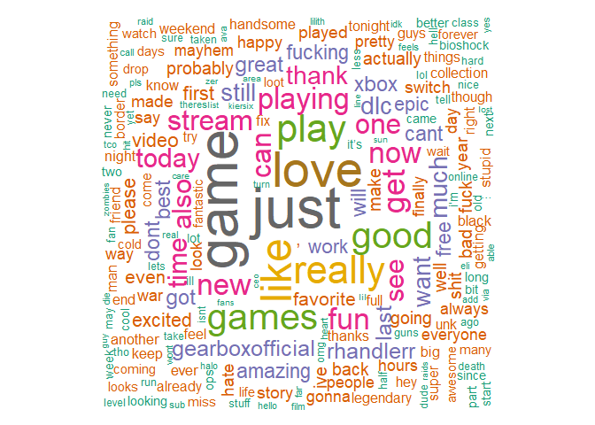
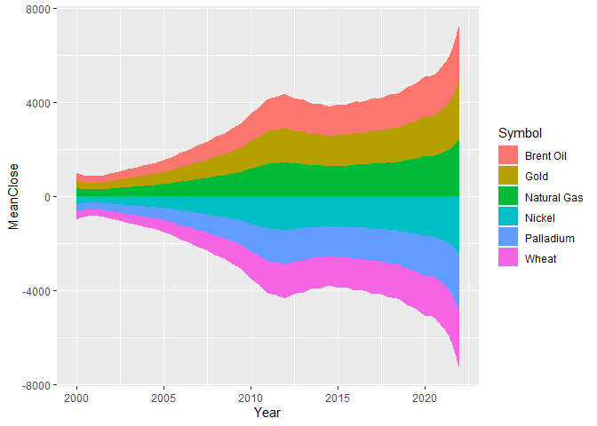
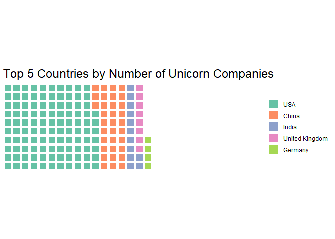

PEC2\_TecnicasViz
================
Victor H. Ayala Sánchez
19/4/2022

Librerias

``` r
library(tidyverse)
library(ggstream)
library(lubridate)

library(quanteda)
library(wordcloud)
library(RColorBrewer)
library(tidytext)
library(tm)

library(waffle)
```

## Técnica 1: Wordcloud

Se puede definir como una representación visual de las palabras que
componen un texto o conjunto de textos. En la medida que la palabra es
mayor en tamaño significa que aparece con mayor frecuencia dentro de los
datos analizados.

De acuerdo a autores como [Hassan-Montero, Herrero-Solana y
Guerrero-Bote](https://yusef.es/tagclouds_eyetracking.pdf), los
wordclouds nacieron a partir de los TagCloud, una herramienta visual o
una representación visual que tenía como objetivo representar aquellos
tags o etiquetas relacionados a temas más populares en la web.

Este tipo de visualización es utilizada para representar datos
categóricos o cualitativos, palabras y su respectiva frecuencia. La
estructura necesaria para la generación de un WordCloud dependerá del
algoritmo o forma de graficar que se utiliza, pero por lo generar es una
matriz donde cada fila corresponde a una palabra y su respectivo número
de apariciones.Es necesario realizar una limpieza previa para sacar lo
que en procesamiento del lenguaje natural o text mining comunmente se
llama stop word o palabras con poco valor informativo.

La principal limitación de la técnica es que no se pueden graficar todas
las palabras, porque no quedaría correctamente representadas o serían
impercetibles al ojo humano. Por esta razón la recomendación es tomar un
top de palabras. La segunda limitación analizada es que el tamaño de la
palabra nos da un posición relativa de una palabra con respecto a otra,
pero a ciencia cierta es imposible saber si un tópico o término
representa el doble con respecto al otro sin mirar la matriz input que
se utiliza para graficar.

``` r
data_1 <- read.csv2("data/Tec1/twitter_training.csv", sep = ",", col.names = c('TweetID','Entity','Sentiment','TweetContent'), nrows = 2500)

print(head(data_1))
```

    ##   TweetID      Entity Sentiment
    ## 1    2401 Borderlands  Positive
    ## 2    2401 Borderlands  Positive
    ## 3    2401 Borderlands  Positive
    ## 4    2401 Borderlands  Positive
    ## 5    2401 Borderlands  Positive
    ## 6    2402 Borderlands  Positive
    ##                                                                                                                                                                                                                                                                                     TweetContent
    ## 1                                                                                                                                                                                                                                            I am coming to the borders and I will kill you all,
    ## 2                                                                                                                                                                                                                                             im getting on borderlands and i will kill you all,
    ## 3                                                                                                                                                                                                                                            im coming on borderlands and i will murder you all,
    ## 4                                                                                                                                                                                                                                      im getting on borderlands 2 and i will murder you me all,
    ## 5                                                                                                                                                                                                                                          im getting into borderlands and i can murder you all,
    ## 6 So I spent a few hours making something for fun. . . If you don't know I am a HUGE @Borderlands fan and Maya is one of my favorite characters. So I decided to make myself a wallpaper for my PC. . Here is the original image versus the creation I made :) Enjoy! pic.twitter.com/mLsI5wf9Jg

Realizamos algunas transformaciones previo al proceso de graficar.

``` r
docs <- Corpus(VectorSource(data_1$TweetContent))

docs <- docs %>%
  tm_map(removeNumbers) %>%
  tm_map(removePunctuation) %>%
  tm_map(stripWhitespace)
docs <- tm_map(docs, content_transformer(tolower))
docs <- tm_map(docs, removeWords, stopwords("english"))


dtm <- TermDocumentMatrix(docs)
matrix <- as.matrix(dtm)
words <- sort(rowSums(matrix),decreasing=TRUE) 
df <- data.frame(word = names(words),freq=words)
df = df[-1,]

wordcloud(words = df$word, freq = df$freq, 
          min.freq = 5, max.words=500, 
          random.order=FALSE, 
          rot.per=0.35,
          colors=brewer.pal(8, "Dark2"))
```

<!-- -->

## Técnica 2: StreamGraph

El Streamgraph o gráfico de flujo es un tipo de visualización que se
conforma por áreas apiladas que se desplazan por un eje horizontal. Este
gráfico se popularizó a partir de un [artículo publicado por Amanda Cox
el New York Times en febrero de
2008](https://en.wikipedia.org/wiki/Streamgraph) y que trataba sobre los
ingresos generados por taquillas de diferentes películas.

El gráfico se compone de un eje X, generalmente con una variable
temporal y un variable cuantitativa en el eje Y, para poder generar
diferentes áreas es necesario contar con una tercera variable, en este
caso cualitativa. La representación visual nos permite comparar los
diferente niveles de la variable cualitativa en función de una variable
cuantitativa a lo largo de un período de tiempo.

Los limites del tamaño del dataset para utilizar esta técnica se
relacionan más a la capacidad de procesamiento que tengamos, es
importante agregar la data en períodos de tiempo grandes (como los años)
para poder hacer una visualización interpretable. No sería recomendable
tener más de 5 o 6 categorías en la variable cualitativa debido a que
podría volver al gráfico díficil de leer. Esta última sería la principal
limitante, sumando además a que en teoría el gráfico de flujo no podría
representar valores negativos.

``` r
data_2 <- read.csv2("data/Tec2/commodity 2000-2022.csv", sep = ",")
```

Realizamos algunas transformaciones para obtener el año y agrupar por
dicho campo

``` r
data_2$Date2 <- ymd(data_2$Date)
data_2$Year <- year(data_2$Date2)

data_2<-data_2 %>% 
  arrange(Symbol,Date2, Close) 

data_2 %>% 
  group_by(Symbol, Year) %>% 
  summarize(MeanClose = mean(as.numeric(Close), na.rm=TRUE)) %>%
  ggplot(aes(x=Year, y=MeanClose, fill=Symbol)) + geom_stream()
```

<!-- -->

Por defecto el geom stream crea un espejo, es necesario setear un
parámetro más para obtener un gráfico un poco más limpio.

``` r
data_2 %>% 
  group_by(Symbol, Year) %>% 
  summarize(MeanClose = mean(as.numeric(Close), na.rm=TRUE)) %>%
  ggplot(aes(x=Year, y=MeanClose, fill=Symbol)) + geom_stream(type = "ridge") 
```

<!-- -->

## Técnica 3: Isotype & Unit charts

Se trata de gráficos utilizados para representar frecuencias. Se utiliza
para la representación de estadísticas descriptivas, frecuencias, etc.
Las visualizaciones estilo Isotype son consideradas como precursores de
los gráficos y técnicas de visualización de datos de la actualidad.
ISOTYPE es el acrónimo en ingles de International System Of Typographic
Picture Education, traducido al español como Sistema internacional de
educación de imágenes topográficas. Dicho sistema fue inventado por Otto
Neurath en colaboración con su esposa Marie Neurath y Gerd Arntz. El
objetivo de las personas mencionadas fue crear diseños educativos para
representar estadísticas por medio de pictogramas, [acá se pueden
encontrar algunos
ejemplos](https://datavizblog.com/2013/08/06/dataviz-history-isotype-charts-the-vintage-visual-language-that-gave-rise-to-modern-infographics/).

Para realizar la visualización como input se necesita una tabla con la
variable cualitativa y realizar un procesamiento de frecuencias, es
decir contar la aparición de cada nivel de dicha variable cualitativa.
La ventaja principal es el impacto visual que puede tener la
representación de este estilo en la comunicación de cómo se distribuye
una variable cualitativa. La desventaja es que no nos aporta más
información: usualmente no tienen porcentajes, sabemos quién es el grupo
mayoritario, pero no su magnitud, es imposible saber en el ejemplo
presentado si las compañías tipo unicornio en Estados Unidos representan
un 70 u 80% entre los países top.

``` r
data_3 <- read.csv2("data/Tec3/Unicorn_Companies.csv", sep = ",")
```

``` r
comp <- data_3 %>% 
  group_by(Country) %>% 
  summarize(NumberOfCompanies = n()) %>% 
  arrange(NumberOfCompanies, desc(NumberOfCompanies)) %>% 
  tail(5)
```

``` r
print(comp)
```

    ## # A tibble: 5 x 2
    ##   Country        NumberOfCompanies
    ##   <chr>                      <int>
    ## 1 Germany                       24
    ## 2 United Kingdom                42
    ## 3 India                         63
    ## 4 China                        168
    ## 5 United States                536

``` r
comp <- c(`USA`=536,`China`=168,`India`=63,`United Kingdom`=42,`Germany`=24)

waffle(comp/5, rows = 10, glyph_size = 10, title = "Top 5 Countries by Number of Unicorn Companies",  pad = 12)
```

<!-- -->
