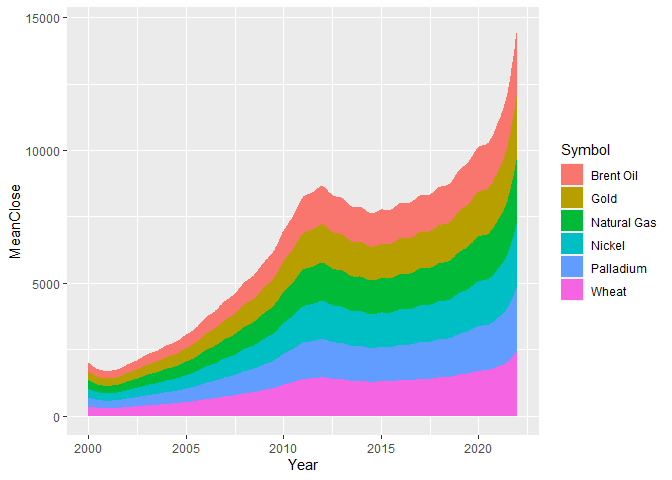
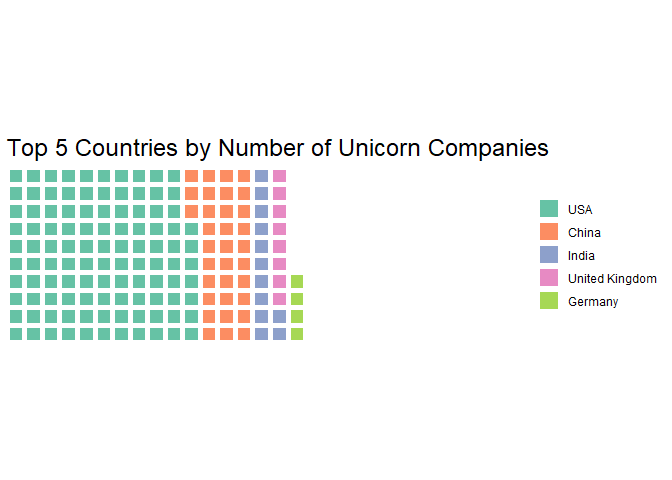

PEC2\_TecnicasViz
================
Victor H. Ayala Sánchez
19/4/2022

Librerias

``` r
library(tidyverse)
library(ggstream)
library(lubridate)

library(quanteda)
library(wordcloud)
library(RColorBrewer)
library(tidytext)
library(tm)

library(waffle)
```

## Técnica 1: Wordcloud

Se puede definir como una representación visual de las palabras que
componen un texto o conjunto de textos. En la medida que la palabra es
mayor en tamaño significa que aparece con mayor frecuencia dentro de los
datos analizados.

Este tipo de visualización es utilizada para representar datos
categóricos

``` r
data_1 <- read.csv2("data/Tec1/twitter_training.csv", sep = ",", col.names = c('TweetID','Entity','Sentiment','TweetContent'), nrows = 2500)

docs <- Corpus(VectorSource(data_1$TweetContent))

docs <- docs %>%
  tm_map(removeNumbers) %>%
  tm_map(removePunctuation) %>%
  tm_map(stripWhitespace)
docs <- tm_map(docs, content_transformer(tolower))
docs <- tm_map(docs, removeWords, stopwords("english"))


dtm <- TermDocumentMatrix(docs)
matrix <- as.matrix(dtm)
words <- sort(rowSums(matrix),decreasing=TRUE) 
df <- data.frame(word = names(words),freq=words)
df = df[-1,]

wordcloud(words = df$word, freq = df$freq, 
          min.freq = 5, max.words=500, 
          random.order=FALSE, 
          rot.per=0.35,
          colors=brewer.pal(8, "Dark2"))
```

<!-- -->

## Técnica 2: Stream Graph

``` r
data_2 <- read.csv2("data/Tec2/commodity 2000-2022.csv", sep = ",")
data_2$Date2 <- ymd(data_2$Date)
data_2$Year <- year(data_2$Date2)

data_2<-data_2 %>% 
  arrange(Symbol,Date2, Close) 

data_2 %>% 
  group_by(Symbol, Year) %>% 
  summarize(MeanClose = mean(as.numeric(Close), na.rm=TRUE)) %>%
  ggplot(aes(x=Year, y=MeanClose, fill=Symbol)) + geom_stream()
```

<!-- -->

``` r
data_2 %>% 
  group_by(Symbol, Year) %>% 
  summarize(MeanClose = mean(as.numeric(Close), na.rm=TRUE)) %>%
  ggplot(aes(x=Year, y=MeanClose, fill=Symbol)) + geom_stream(type = "ridge") 
```

<!-- -->

## Técnica 3: Isotype & Unit charts

``` r
data_3 <- read.csv2("data/Tec3/Unicorn_Companies.csv", sep = ",")
```

``` r
comp <- data_3 %>% 
  group_by(Country) %>% 
  summarize(NumberOfCompanies = n()) %>% 
  arrange(NumberOfCompanies, desc(NumberOfCompanies)) %>% 
  tail(5)
```

``` r
print(comp)
```

    ## # A tibble: 5 x 2
    ##   Country        NumberOfCompanies
    ##   <chr>                      <int>
    ## 1 Germany                       24
    ## 2 United Kingdom                42
    ## 3 India                         63
    ## 4 China                        168
    ## 5 United States                536

``` r
comp <- c(`USA`=536,`China`=168,`India`=63,`United Kingdom`=42,`Germany`=24)

waffle(comp/5, rows = 10, glyph_size = 10, title = "Top 5 Countries by Number of Unicorn Companies",  pad = 12)
```

<!-- -->
